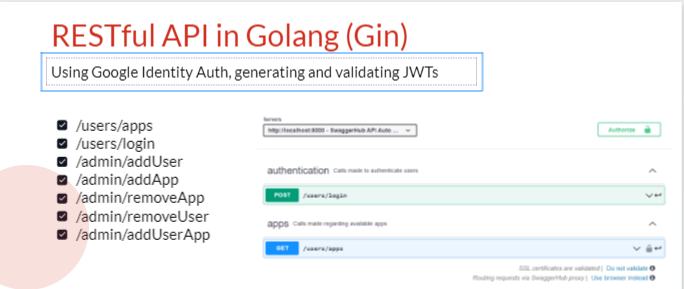

Nezha - We don't trust!
-----------------------

Nezha is an application deployment and secure access platform based on the Zero-Trust security framework for any application, irrespective of scale, complexity, and user size.

Access and Usage
----------------

We provide you three ways to ways to access your deployed applications or machines via Nezha.

Using the Nezha Client CLI
+++++++++++++++++++++++++++++++
NOTE: The following instructions assume that you have a deployment running somewhere in a Kubernetes environment using the Nezha Helm chart provided in our repository
and have available a loadbalancer HOST:IP or Domain available to connect to and have downloaded the Nezha client CLI. If not, follow the instructions in our readME to get started.

    1.  Run the following command to login into your host machine
        ::
            ./Nezha login <LoadBalancer HOST:IP | Domain>   

This is a one time command and you would not be required to run it again provided you do not delete any config files or want to login as another user or into another host machine.
Answer the prompts as they appear and you should be set up to connect to your applications. 
    
    2.  Run the following command to list your currently running applications.
        ::
            ./Nezha list
    3.  Run the following command to connect to a particular application.
        ::
            ./Nezha <application identification ID>

Using the Web Terminal
++++++++++++++++++++++

Using the loadbalancer HOST:IP or domain generatred during server setup go to the following route and follow the instructions as they appear::

    https://<LoadBalancer HOST:IP |Domain>:<PORT>/portal/

A welcome screen like below should be seen, hit the login or signup button on the top right.
.. image:: https://raw.githubusercontent.com/thebjorn/pydeps/master/docs/_static/pydeps-pylib.svg?sanitize=true
  :width: 400
  :alt: Welcome Page

A login screen like below should be seen, enter your credentials and hit login
.. image:: https://raw.githubusercontent.com/thebjorn/pydeps/master/docs/_static/pydeps-pylib.svg?sanitize=true
  :width: 400
  :alt: Login Page

One logged in, you should be able to see a dashboard like the template below::
.. image:: https://raw.githubusercontent.com/thebjorn/pydeps/master/docs/_static/pydeps-pylib.svg?sanitize=true
  :width: 400
  :alt: Dashboard Page

Choose the application you wish to connect to and hit connect::
.. image:: https://raw.githubusercontent.com/thebjorn/pydeps/master/docs/_static/pydeps-pylib.svg?sanitize=true
  :width: 400
  :alt: Open Web Terminal

Using the following API endpoints
+++++++++++++++++++++++++++++++++

We provide a number of and everincreasing API endpoints to allow you to incorporate Nezha in your own proprietary software or create Custom Resource Definitions.
NOTE: These endpoints will return a HTTP Status Code 503-Service Unavailable response if any authentication TOKENS, CERTS or JSON payload are missing or are incorrect.
You may use any of the following endpoints to interact with Nezha and connect to your application::
